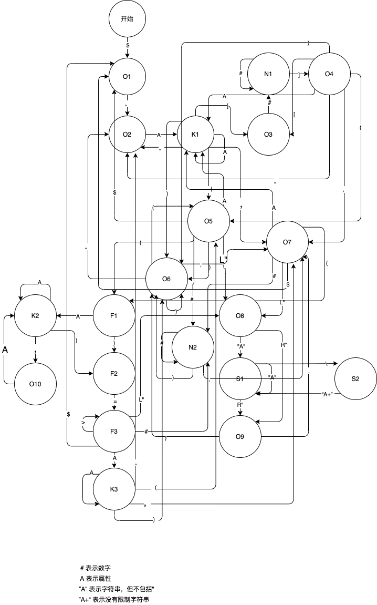

# Ctxexp Parser

> 上下文表达式解析器

在不能动态执行 JS 语言的环境（微信小程序）里执行类 JS 的调用函数。

## Feature

- [x] 轻量包，未压缩 16k，压缩 4k
- [x] 单元测试 >85% 的代码覆盖
- [x] 使用状态机编写词法分析
- [x] 动态执行表达式
- [x] 调用方法支持传入 Number `+1 -1 1.1`
- [x] 调用方法支持传入 String
- [x] 调用方法支持传入 Callback `([参数])=><返回值>`
- [x] 支持传入多个参数
- [x] 支持嵌套调用
- [x] 语法错误检查
- [x] 支持链式调用、链式访问
- [x] 支持数组的访问

## Tip

- 不支持在表达式中使用空格 如 `$.fn(1, 2)`
- 回调函数只支持简单的箭头函数

## Install

```
npm i ctxexp-parser
# yarn add ctxexp-parser
```

## Uses

```js
const { CtxexpParser } = require("ctxexp-parser");
// import { CtxexpParser } from "ctxexp-parser";

const $ = {
  a: "hello",
  fn(str, str2) {
    return str + str2;
  },
  runs(...cbs) {
    return cbs.map((cb, index) => cb(index));
  },
  Type(i) {
    return ["A", "D", "C"][i];
  },
};

const exp = `$.a`;
const res = new CtxexpParser($, exp).exec();
console.log(res); // hello

const exp1 = `$.fn($.a," cxtexp")`;
const res1 = new CtxexpParser($, exp1).exec();
console.log(res1); // hello cxtexp

const exp2 = `$.runs((i)=>$.Type(i)).join("")`;
const res2 = new CtxexpParser($, exp2).exec();
console.log(res2); // A
```

[查看更多例子](https://github.com/WumaCoder/ctxexp-parser/blob/main/test/index.spec.ts)

## State



## About

MIT License
